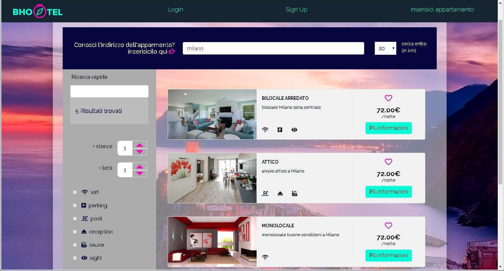
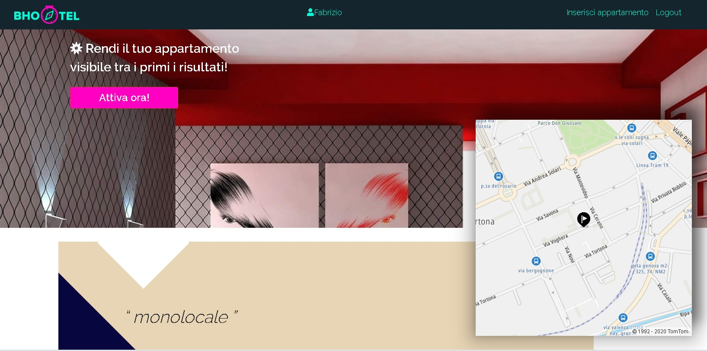

## Application to find and manage the rental of apartments, made using Laravel MVC Framework. Final Boolean course team project. ##
### Features: ###
* User registration and authentication
* add, remove and edit apartments
* save geographic address location using tomtom api, and show map
* messages/mails to users
* dynamic address/location search with Vue.js
* client side and back-end validation
* page views counter
* apartments graphs with views and messages statistics
* add sponsorship to apartment with Braintree

